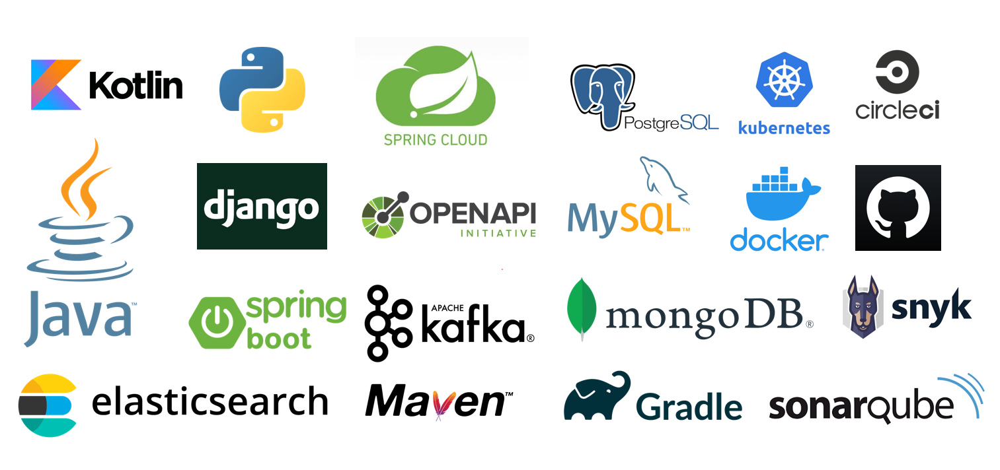
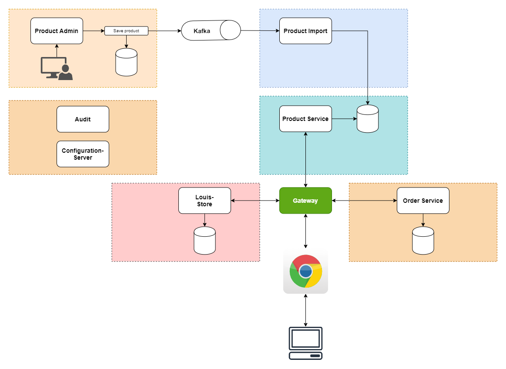

  
# bookstore-microservices
A simple microservices project

## Technologies

## System Diagram

### TODO

[x] Zipkin  
[x] Spring Cloud Feign  
[] OAuth  
[x] Kubernetes  
[x] Spring Cloud Configuration  
[x] Spring Cloud Stream  
[] Ribbon  
[] Prometheus  
[] ElasticSearch  
[] HashiCorp Vault  
[x] Jenkins  
[x] Sonarqube  
[] Fault Tolerance  
[x] Liquibase  
[x] Kotlin projects
[x] Python projects

Detail tasks at [ClickUp](https://app.clickup.com/14355871/v/s/32109655)
